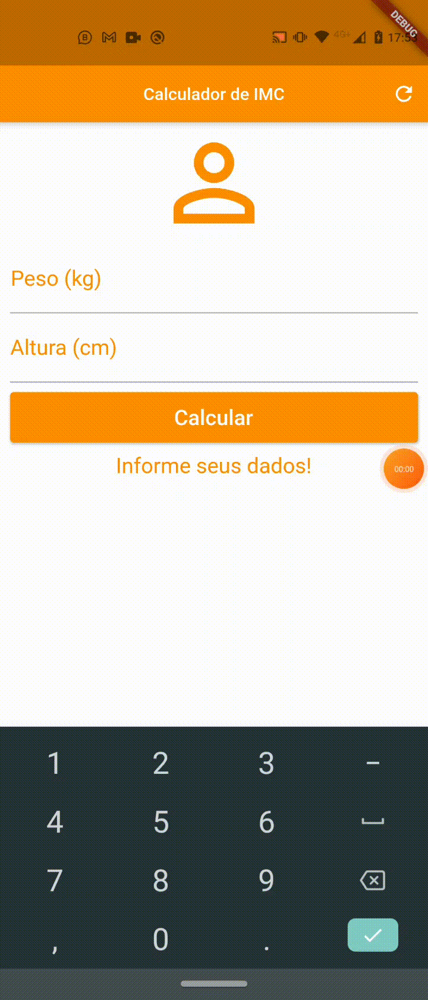

<p align="center">
      
</p>

<h1 align="center">BMI Calculator</h1>

<h2 align="center">Topics 📋</h2>

   <p>
   
   - [About 📖](#about-)
   - [Preview 📱](#preview-)
   - [Layout 🎨](#layout-)
   - [Functionalities 🛠️](#functionalities-%EF%B8%8F)
   - [Challenges and Learnings along the way 🤯](#challenges-and-learnings-along-the-way-)
   - [Notion Files 📋](#notion-files-)
   - [How to Use 🤔](#how-to-use-)
   - [How to Contribute 💪](#how-to-contribute-)
   - [License 📝](#license-)

   </p>

---

<h2 align="center">About 📖</h2>

<p>
    This project was a simple Body Mass Index Calculator made with Flutter .<br>
    An Application that you can use it to assess whether you are at the ideal weight according to your height. Depending on this result, you can know if you are at the ideal wight, below or above.<br>
    This application is in version 2.1. Ready for another one!🚀 <br>
</p>

---

<h2 align="center">Preview 📱</h2>

   <p align="center">
      
   </p>

---

<h2 align="center">Layout 🎨</h2>

   <p align="center">
      The Layout was developed by instructor <a href="https://linkedin.com/in/danielciolfi">Daniel Ciolfi</a>, and you can access it on Udemy:
   
   - **["Creating Android and iOS Apps with Flutter - Create 14 Apps"](https://www.udemy.com/course/curso-completo-flutter-app-android-ios/?referralCode=1355952A966260D40D18)** 📱
   </p>

---   

<h2 align="center">Functionalities 🛠️</h2>

   <p>
   
   - Scaffold,
  
  - AppBar,
  
  - SingleChildScrollView,
  
  - RaisedButton,
  
  - Forms,
  
  - GlobalKey,
  
  - TextField,
  
  - TextFormField,
  
  - Many other amazing things!
  
   </p>

---

<h2 align="center">Challenges and Learnings along the way 🤯</h2>

   <p>
   In this project I didn't have so many problems, they were easy to solve and follow, to be honest. The biggest challenges came during the development of version 2.0, which I      wil talk about.
   In this version, I added good programming practices, making more readable, easier to understand and maintain, with methods, features, new widgets and styles. <br>
   </p>

---

<h2 align="center">Notion Files 📋</h2>

- [Udemy](https://www.udemy.com/course/curso-completo-flutter-app-android-ios/?referralCode=1355952A966260D40D18)

---

<h2 align="center">How to Use 🤔</h2>

   ```
   First of all, correctly configure the Flutter development environment on your machine, see https://flutter.dev/docs/get-started/install
   
   - Clone this repository:
   $ git clone https://github.com/Palacios-OPTIMOS/CalculadoraIMC-Flutter CalculadoraIMC-Flutter

   - Enter in directory:
   $ cd CalculadoraIMC-Flutter

   - For install dependencies:
   $ flutter pub get

   - Run the app: 
   $ flutter run
   ```

---

<h2 align="center">How to Contribute 💪</h2>

   ```
   - Fork the project 

   - Create a new branch with your changes:
   $ git checkout -b my-feature

   - Save your changes and create a commit message telling you what you did:
   $ git commit -m "feature: My new feature"

   - Submit your changes:
   $ git push origin my-feature
   ```

---

<h2 align="center">License 📝</h2>

<p align="center">
   This repository is under MIT license. You can see the <a href="https://github.com/Palacios-OPTIMOS/CalculadoraIMC-Flutter/blob/main/LICENSE">LICENSE</a> file for more details.
</p>

---

   >This project was developed by **[@Damian Palacios](https://www.linkedin.com/in/damianpalacioss/)** <br>
   >Instructor **[Daniel Ciolfi](https://linkedin.com/in/danielciolfi)**, in Udemy **["Creating Android and iOS Apps with Flutter - Create 14 Apps"](https://www.udemy.com/course/curso-completo-flutter-app-android-ios/?referralCode=1355952A966260D40D18)**.<br>
   If it helped you, give ⭐<br>
   If you wanna help me, contribute 💪

---

  <div align="center">
 
   [](https://www.linkedin.com/in/damianpalacioss/)
  
  </div>
